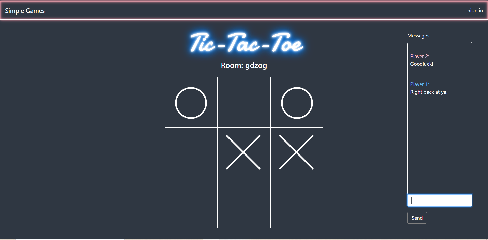
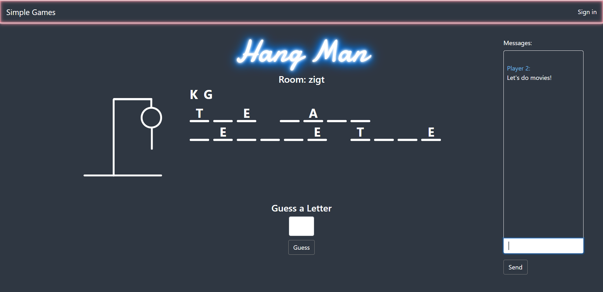

# simple-games
A small collection of some easy to play multiplayer games. The application is a working MVP but is still in development. Upcoming features and known bug can be found in the development section.

## Description
Simple games is a web application that contains a collection of some basic games to a play with a friend. I am putting to use several new technologies I am picking up including sass, redux, and <span>socket.</spann>io to get the application working. It is currently at mininmal viable product but will include more games and features in the future.

## Technologies
* Node.js
* Express
* Mongodb and mongoose
* React.js
* Bootstrap
* jasonwebtoken
* bcrypt
* Sass
* Redux
* <span>socket.</spann>io

## Installation
It's simple enough to get running in a local dev environment. The application uses MongoDB for user data. Make sure to install mongoDB locally. Once MongoDB is installed, just clone the repo and run the following in the root directory:
```
npm install
npm run dev
```
## Developement
### Future Features
* Display players present in a room
* Delve more into error handling for user/server communication interupts/ disconnects
* Connect Four and other great 'simple games'
* Much much more
### Bugs and Issues
* Reppetition issue with joining rooms
* Need to check for valid room code

## Links
Deployed at:  https://simple-games8723.herokuapp.com/

## Screenshots


